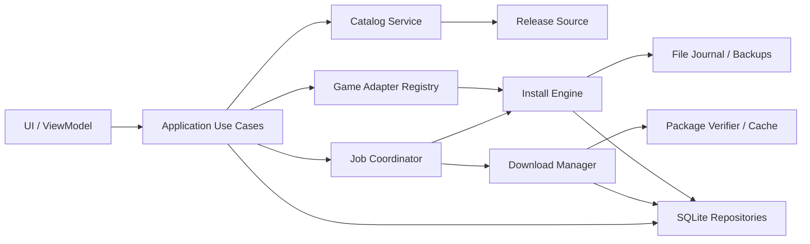
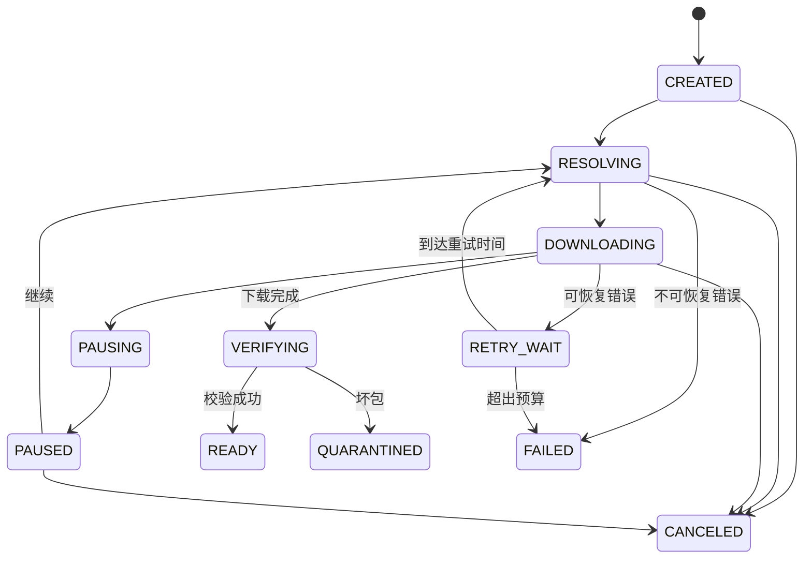
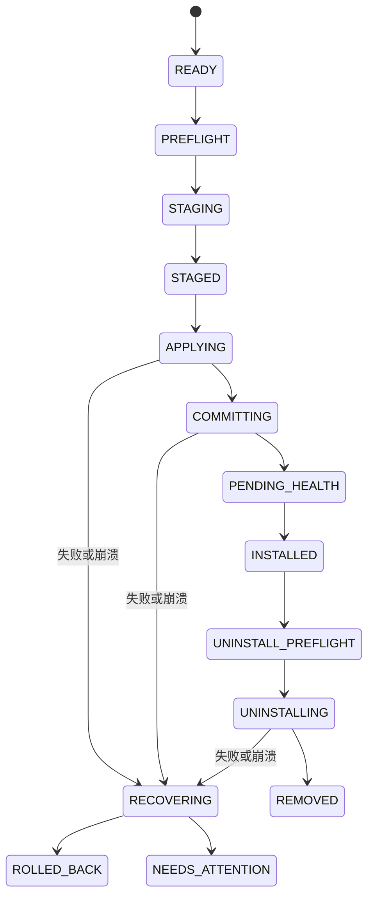
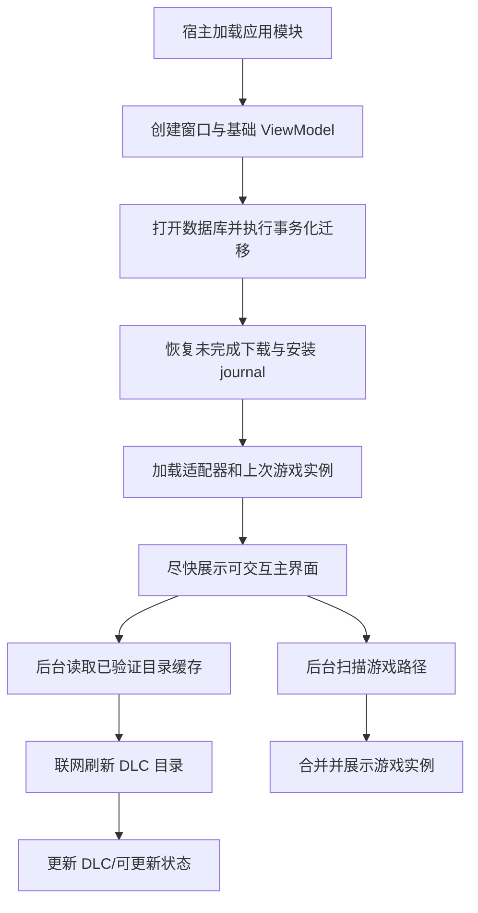

# SignRiver DLC Hub 模块化实施规划

> 状态：设计草案 v1
>
> 日期：2026-07-11
>
> 关联文档：[模块化更新架构](./update-architecture.md)

## 1. 文档目的

本文定义 SignRiver DLC Hub 从“模块化更新框架”发展为“多游戏 DLC 管理器”所需的业务模块、数据契约、主流程、界面结构、下载与安装可靠性要求，以及分阶段交付计划。

当前 `0.1.0` 已有稳定启动器、外部应用模块、应用自更新和初始化失败回滚。后续游戏与 DLC 业务应继续放在 `app/versions/<version>/` 中，避免每增加一个游戏都重新发布启动器。

### 1.1 当前实施进度

- [x] `GameAdapter` 基础协议、领域模型、注册表和 Mock 适配器。
- [x] SQLite 数据库生命周期、schema migration 和游戏安装实例仓储。
- [x] 游戏自动发现编排、候选去重、历史路径恢复和手动路径管理。
- [x] 首个真实游戏适配器（Stellaris Windows Steam，App ID 281990）与 Steam 库扫描器。
- [x] GitLink ReleaseSource 与 Stellaris 只读 DLC 目录服务（`ste` Release）。
- [x] 下载状态机、整包重试、暂停/取消、下载后 SHA-256 计算、内容寻址缓存和坏包隔离。
- [x] SQLite 下载任务持久化、崩溃状态恢复、单线程顺序队列及速度/ETA 计算。
- [x] Stellaris Release 完整 DLC 滚动列表及逐项下载、取消和失败重试操作。
- [x] DLC 搜索、状态筛选、批量选择/顺序下载、整批暂停/继续/取消及下载带宽限制策略。
- [x] 不支持 Range 时暂停即删除半包、继续时整包重下，并保留已完成 DLC。
- [x] Stellaris 安装计划、同卷 staging、事务 journal、覆盖备份、原子提交、失败回滚和中断恢复基础引擎。
- [x] 安装回执持久化、安装目录指纹、安全卸载、原目录恢复及健康/缺失/修改判定。
- [x] 文件级归属清单、缺失/修改/未知文件审计及“只补缺失文件”的保守修复。
- [x] 安装应用服务、落库失败补偿、卸载对账及 DLC 更新回执链。
- [x] 简化 Release 目录协议：直接识别 `dlcNNN_*.zip`，不要求维护额外清单文件。
- [x] 用户界面安装管理接入：包结构与 DLC ID 校验、下载后自动安装、目录已安装检测、后台检查、保守修复和安全卸载。
- [x] 启动恢复 READY 缓存记录，并扫描内容寻址缓存补回旧版遗漏的已完成任务。
- [x] 缓存按资源类型区分版本策略：DLC 包可跨卸载长期复用；补丁 DLL 与 AppInfo 绑定 GitLink Release 附件 ID，同一附件复用、附件更新后强制重新下载，禁止按同名文件误认旧补丁。
- [x] 游戏安装布局卡带化：每张卡带声明 DLC 与补丁相对目录，安装、检测、卸载、审计和修复共用配置，并拒绝目录越界。
- [x] 预置 Civilization VI 与 Hearts of Iron IV 卡带：独立 Steam 检测、Release/AppInfo、DLC/补丁目录与通用目录包安装协议；服务端同步自动补齐内置卡带工作区。
- [x] SQLite 用户状态、独立网络测速、缓存管理与日志入口及最近日志预览；客户端固定单线程且不提供限速配置。
- [x] 侧边导航简化为 DLC 库、下载任务、日志和设置；版本与更新信息合并进设置，不保留内容重复的独立“关于”页。
- [x] 顶部游戏选择器、平台信息、路径健康状态及受限 HTTPS 作者/仓库外链。
- [x] 下载任务页操作、失败/取消记录清理、缓存占用分析与引用保护型安全清理。
- [x] 下载任务全记录清理、GitLink 固定时长测速、动态全选/取消全选按钮。
- [x] 外部与本程序安装 DLC 的单项强制卸载、全部 DLC 批量卸载。
- [x] CreamAPI 补丁引擎：`stellaris_appinfo.json` 驱动的 `cream_api.ini` 渲染、原子替换、原版备份保留、大小审计、幂等重入与失败回滚。
- [x] “一键解锁”：先拉取三个补丁资源（`steam_api64.dll`、`steam_api64_o.dll`、`<game>_appinfo.json`）并做补丁健康审计，再顺序下载并安装勾选的 DLC。
- [x] “一键修复”：二次确认后清空全部已安装 DLC、清空全部下载记录与内容缓存、重置补丁三件套，再按解锁流程重新下载与安装。
- [x] “一键移除补丁”：删除补丁 DLL 与 `cream_api.ini`，并把 `steam_api64_o.dll` 恢复为 `steam_api64.dll`。
- [x] “恢复游戏原版”：只撤销本程序有安装凭据的 DLC，并恢复被覆盖前的同名内容；恢复前检查游戏进程、未完成下载和原版 DLL 备份，游戏原有 DLC 不会被删除，缓存默认保留并允许单独清理。
- [x] 日志级别/关键词筛选、复制及脱敏诊断包导出。
- [x] 首次使用引导、全局网络/任务/速度/缓存状态栏及操作结果通知。
- [x] Windows 完整包/模块包构建、内容审计及冻结 EXE 启动冒烟。
- [x] 远程启动公告：读取 `hub` Release / 本地 `config/announcement.json`，支持「下次更新前不再显示」。
- [x] 远程游戏卡带主表：启动读取 `hub` Release / 本地 `config/cartridges`，按需下载单游戏卡带；发布器可导出客户端卡带主表。
- [ ] Overlay 型共享文件引用计数，以及可信目录/用户授权校验后的安装 UI。

## 2. 产品目标与边界

### 2.1 最终用户流程

1. 打开程序，程序恢复上次选择并在后台扫描已支持的游戏。
2. 用户选择游戏和具体安装实例；系统默认自动检测，也允许手动指定路径。
3. 程序从该游戏配置的 GitLink Release 数据源刷新 DLC 目录。
4. 用户查看 DLC 的版本、大小、兼容性、依赖、安装和下载状态。
5. 用户选择单个或多个 DLC，执行下载、暂停、继续、取消、重试、安装、更新、修复或卸载。
6. 下载和安装任务在切换游戏或重启程序后仍可恢复。
7. 所有重要操作有可理解的状态提示、可筛选日志和可导出的诊断信息。

### 2.2 功能边界

- “一键解锁”在产品和代码中建议命名为“一键部署/启用”：只检测、部署和启用用户有权使用的内容。
- 不实现绕过 DRM、商店授权、付费校验或其他访问控制的能力。
- Release 平台只用于发现和传输文件，不作为可信根；真正决定可安装内容的是经过验证的目录清单、包大小和摘要。
- v1 包格式不执行远端脚本，不接受符号链接、硬链接、设备文件或任意管理员命令。
- DLC 状态、任务状态和安装记录与 `app/state.json` 分离；业务故障不能破坏启动器版本状态。

## 3. 总体架构

### 3.1 分层关系



依赖规则：

- UI 只调用应用用例，不直接操作网络、数据库或游戏目录。
- `GameAdapter` 只描述游戏差异并生成声明式操作计划，不自行下载或任意写文件。
- `ReleaseSource` 只处理平台 API、分页、鉴权和资源地址解析。
- `CatalogService` 负责清单验证、兼容性、依赖与冲突。
- `DownloadManager` 负责传输状态，不负责解压和安装。
- `InstallEngine` 是唯一可以根据已审计计划修改游戏目录的组件。
- 现有宿主 `UpdateClient` 继续只负责应用模块/启动器更新；DLC 使用业务模块内独立的下载器、任务表和缓存协议，两套状态不得混用。

### 3.2 建议目录结构

```text
app/versions/<version>/
├── app_entry.py                 # 模块入口，只负责创建 Application
├── bootstrap.py                 # 依赖装配、数据库迁移、恢复任务
├── domain/                      # 纯模型、状态、兼容性/依赖规则
├── application/                 # 选择游戏、刷新目录、下载安装等用例
├── adapters/
│   ├── protocol.py              # GameAdapter 契约
│   ├── registry.py              # 适配器注册表
│   ├── common/                  # Steam/注册表/目录扫描公共能力
│   └── <game_id>/               # 每个游戏一个独立适配器
├── infrastructure/
│   ├── persistence/             # SQLite、迁移、repositories
│   ├── catalog/                 # 目录清单与 ReleaseSource
│   ├── download/                # 队列、续传、重试、限速
│   ├── packages/                # 缓存、摘要、隔离区、安全解压
│   ├── installer/               # 事务、备份、回执、卸载、修复
│   └── platform/                # 进程、磁盘、注册表、凭据库
└── ui/
    ├── views/                   # 页面和组件
    ├── viewmodels/              # 可测试的界面状态
    ├── assets/                  # 图标、主题、字体配置
    └── navigation.py            # 页面路由
```

共享数据只写入 `context.paths.data` 和 `context.paths.cache`；版本模块目录视为只读。

## 4. 需要实现的模块

| 模块                  | 核心职责                                                    | 首版优先级 |
| --------------------- | ----------------------------------------------------------- | ---------- |
| 应用组合与生命周期    | 数据库迁移、单实例锁、服务装配、恢复未完成事务、后台刷新    | P0         |
| 游戏适配器注册表      | 注册游戏、描述能力、隔离不同游戏规则                        | P0         |
| 游戏发现与路径服务    | Steam/注册表/常见目录扫描、候选去重、手动路径校验与保存     | P0         |
| DLC 目录服务          | 获取、缓存、验证目录，计算兼容性、依赖、冲突和可更新状态    | P0         |
| GitLink ReleaseSource | Release 列表、附件解析、分页、缓存验证、错误归一化          | P0         |
| 下载管理器            | 队列、暂停/继续、断点续传、重连、重试、取消、限速和持久恢复 | P0         |
| 包验证与缓存          | SHA-256/大小验证、安全解压、内容寻址缓存、坏包隔离          | P0         |
| 安装事务引擎          | 预检、staging、备份、journal、原子替换、提交和崩溃恢复      | P0         |
| 卸载/更新/修复        | 根据安装回执安全卸载、恢复覆盖文件、更新回滚、扫描修复      | P0         |
| 任务协调器            | 将下载、校验、安装串成持久任务，向 UI 发布事件              | P0         |
| SQLite 持久层         | 游戏实例、DLC、任务、安装回执、设置和 schema migration      | P0         |
| 主界面与 ViewModel    | 游戏选择、DLC 库、下载任务、日志、设置和状态展示            | P0         |
| 结构化日志与诊断      | 轮转日志、界面日志、关联 task/transaction、脱敏诊断包       | P1         |
| 设置与凭据            | 主题、语言、下载策略、游戏路径、源配置；令牌进系统凭据库    | P1         |
| 通知与首次引导        | 首次扫描、空状态、操作完成/失败通知、版本更新提示           | P1         |
| 第二 ReleaseSource    | 为 GitHub、静态清单或镜像提供同一接口，验证平台解耦         | P2         |
| 高级下载              | 并行分块、按块校验、镜像切换、带宽调度                      | P2         |

## 5. 核心接口与数据模型

### 5.1 GameAdapter

```python
class GameAdapter(Protocol):
    descriptor: AdapterDescriptor

    def discover(self) -> list[InstallationCandidate]: ...
    def validate(self, root: Path) -> ValidationResult: ...
    def inspect(self, installation: GameInstallation) -> GameState: ...

class InstallPlanningAdapter(GameAdapter, Protocol):
    def build_install_plan(
        self, installation: GameInstallation, dlc: DlcEntry, package: ExtractedPackage
    ) -> InstallPlan: ...
    def build_uninstall_plan(
        self, installation: GameInstallation, receipt: InstallReceipt
    ) -> InstallPlan: ...
    def post_validate(self, installation: GameInstallation) -> ValidationResult: ...
```

首个实现阶段只冻结基础 `GameAdapter`；`InstallPlanningAdapter` 在安装事务模型落地时加入。这样发现/验证能力不会被尚未实现的安装类型绑住，也允许只读适配器存在。

约束：

- 适配器输出 `InstallPlan`，不直接执行文件操作。
- 目标路径使用“已验证游戏根目录 + 相对路径”，执行器再次做越界检查。
- 适配器声明支持的平台、商店、游戏版本、安装策略、是否要求关闭游戏及是否需要权限。
- 安装回执保存适配器 ID、适配器版本和 Plan schema，确保未来仍能卸载旧版本产生的文件。

### 5.2 ReleaseSource

```python
class ReleaseSource(Protocol):
    def list_releases(self, source: SourceConfig, cursor: str | None) -> ReleasePage: ...
    def get_release(self, release: ReleaseRef) -> NormalizedRelease: ...
    def resolve_asset(self, asset: AssetRef) -> ResolvedEndpoint: ...
    def probe_capabilities(self, asset: AssetRef) -> SourceCapabilities: ...
```

上层只接触标准化 DTO，不接触 GitLink 的具体 API URL、分页和鉴权格式。下载地址可能是短期 CDN URL，因此持久化 `AssetRef`，需要下载时重新解析地址。

### 5.3 主要模型

| 模型                | 必要字段                                                                                  |
| ------------------- | ----------------------------------------------------------------------------------------- |
| `GameInstallation`  | `id, game_id, adapter_id, root, executable, platform, source, selected, last_seen`        |
| `DlcEntry`          | `dlc_id, game_id, title, asset_name, source_ref`                                          |
| `DownloadJob`       | `job_id, dlc_id, state, bytes_complete, actual_hash, source_ref, retry/error`             |
| `InstallPlan`       | `operations, required_space, requires_game_closed, warnings, expected_state`              |
| `FileOperation`     | `create/replace/delete, relative_target, source, pre_hash, post_hash, overwrite_policy`   |
| `InstallReceipt`    | `game_instance, dlc/version, package_hash, adapter/version, owned_files, backups, status` |
| `FileOwnership`     | `relative_path, receipt_id, installed_hash, ref_count`                                    |
| `TransactionRecord` | `txn_id, type, phase, operation_plan, journal_seq, error, timestamps`                     |

`FileOwnership` 用于避免卸载一个 DLC 时误删另一个 DLC 共用的文件；用户或游戏修改过的文件不得静默删除。

## 6. GitLink Release 与 DLC 目录协议

已使用公开仓库 `signriver/file-warehouse` 验证 Release 列表入口为
`GET /api/{owner}/{repository}/releases`，响应包含 `releases[].attachments[]`。
`ste/dlc001_symbols_of_domination.zip` 的附件端点会忽略 Range 请求并返回完整的
`200 OK` 响应，且未提供 ETag、Content-Length 或 Accept-Ranges。因此下载器必须按来源
记录续传能力；该来源暂停或断线后的首版恢复策略是删除/隔离未完成临时文件并整包重试，
不能把新响应拼接到旧文件。完整包下载后计算 SHA-256，并通过 ZIP 结构和 DLC 编号检查后才可安装。

参考资料：

- [GitLink API Reference](https://www.gitlink.org.cn/docs/api)
- [GitLink CLI Release Management](https://www.gitlink.org.cn/Gitlink/gitlink-cli)

### 6.1 推荐发布约定

- 一个游戏映射一个 GitLink 仓库，或在本地游戏注册表中显式配置仓库映射。
- Stellaris 使用固定的 `ste` Release 承载全部 DLC 资源。
- DLC 包使用稳定命名 `dlcNNN_<name>.zip`，程序根据命名规则自动建立目录。
- 后续新增 DLC 只需向该 Release 添加符合命名规则的 ZIP；既有附件保持不变。
- 程序下载后计算实际 SHA-256，并校验 ZIP 结构、内部 DLC 描述和 DLC 编号。
- 当前只使用一个下载源，不维护额外目录 JSON、签名或镜像切换协议。

### 6.2 DLC 包约定

- 外层文件名必须匹配 `dlcNNN_<name>.zip`。
- 外层 ZIP 必须包含且只包含一个可识别的 `.dlc` 描述文件。
- 描述文件中的 `archive` 必须指向包内同目录的有效内层 ZIP。
- 描述文件名产生的 DLC 编号必须与下载任务中的 `dlcNNN` 一致。
- 禁止路径穿越、符号链接、重复成员、异常文件数量和异常展开体积。

## 7. 下载管理器设计

### 7.1 任务状态机



展示层还可把 `READY -> INSTALLING -> COMPLETED` 合并为一条用户任务，但下载器内部不负责安装。

### 7.2 暂停、续传与重连

1. 下载前通过 `HEAD` 或 `Range: bytes=0-0` 探测总长度、Range、ETag 和 Last-Modified。
2. 先将内容写入 `.part`，任务元数据写入 SQLite；界面状态与文件状态都可跨进程恢复。
3. 暂停时停止派发新读请求、关闭活动响应、刷盘进度，然后进入 `PAUSED`；不通过长期阻塞线程来“暂停”。
4. 继续时使用 `Range` 和强 ETag 的 `If-Range`。若资源身份发生变化，旧片段进入隔离区并从零开始，禁止拼接不同版本。
5. 服务端忽略 Range 并返回 `200` 时，安全降级为整包重下，绝不能把完整响应追加到旧片段。
6. 断网、读超时、`429` 和 `5xx` 使用带抖动的指数退避，并尊重 `Retry-After`；`401/403/404` 等按来源错误类型决定重新解析地址或停止。
7. 临时下载 URL 过期时重新调用 `resolve_asset()`，保留已经确认属于同一摘要的有效片段。
8. 首版实现单流 Range 续传；并行分块与块级摘要在稳定后作为 P2，避免首版同时引入随机写、块账本和多连接调度复杂度。

### 7.3 坏包处理

- 下载完成后计算实际大小与 SHA-256，SHA-256 同时作为内容寻址缓存目录名。
- ZIP 格式、包内路径、DLC 描述、内部资源或 DLC 编号校验失败时，将文件移动到 `cache/quarantine/`，禁止进入安装队列。
- 网络失败可有限次数整包重下；不能无限自动循环。
- 同一附件被判定为结构性坏包后直接失败，等待仓库管理员替换或修复该附件。
- 隔离区设置容量和保留期，默认只保留最近的诊断样本。

### 7.4 下载任务持久字段

`job_id, game_id, dlc_id, asset_name, source_url, temp_path, bytes_complete, actual_sha256, state, reason, attempt, created_at, updated_at`。

不得将访问令牌写入任务表或日志；短期签名 URL也应尽量只存内存。

## 8. 安装、更新、卸载与修复

### 8.1 安装状态机



### 8.2 安装事务

1. 获取目标游戏实例锁，避免两个进程同时修改同一目录。
2. 解析依赖和冲突，检查游戏版本、运行进程、权限、磁盘空间和目标路径。
3. 将已验证包解压到同卷 staging；完成文件数、展开大小、路径、重复项和文件摘要检查。
4. 由 `GameAdapter` 生成确定性的 `InstallPlan`，再由通用执行器做第二次路径和策略审计。
5. 写入并 `fsync` transaction journal，之后才允许修改目标文件。
6. 覆盖前做内容寻址备份；新文件先写同目录临时文件，再原子替换。
7. 每一步记录 pre-hash、post-hash 和备份引用；失败时按 journal 逆序恢复。
8. 适配器执行安装后验证；成功后提交 `InstallReceipt` 和文件归属记录。

优先采用 `versioned`/managed 目录安装后切换 active pointer。只有游戏结构要求直接覆盖时才采用 `overlay` 文件级 journal。

### 8.3 卸载、更新和修复规则

- 卸载只能删除回执明确拥有、且当前摘要仍等于安装后摘要的文件。
- 共用文件通过引用计数管理；仍被其他 DLC 使用时不得删除。
- 用户或游戏修改过的文件默认保留，并在结果中列出，不静默覆盖或丢弃。
- 曾覆盖的原文件仅在当前内容仍属于该 DLC 时恢复备份。
- 存在依赖方时默认阻止卸载；级联卸载必须显式确认并按依赖逆拓扑执行。
- 更新保留 `previous_installation_id` 和必要备份，健康检查失败可回到旧版本。
- “扫描并修复”根据安装回执和文件摘要区分缺失、损坏、用户修改和未知文件，只修复可安全判定的内容。
- 启动时扫描未完成 journal，必须能够幂等地完成提交或回滚，不能靠“文件似乎存在”猜测成功。

## 9. 游戏发现、选择与路径逻辑

### 9.1 自动发现

适配器可以组合以下只读探测方式：

- Steam library folders 和应用 manifest。
- Windows 注册表中的商店/卸载信息。
- 游戏启动器配置文件。
- 常用安装目录和用户上次确认的目录。

候选路径按规范化路径和平台 ID 去重。必须由适配器验证特征可执行文件、必要目录和支持的游戏版本，不能只判断目录存在。

### 9.2 选择规则

- 只有一个有效实例时可以默认选中，但仍展示来源和路径。
- 有多个实例时展示平台、版本、路径和最近使用时间，由用户选择。
- 没有实例时显示清晰空状态并提供“选择目录”和“重新扫描”。
- 手动选择后立即验证；失败时在路径区域就地说明缺少的特征文件或权限，不进入 DLC 操作页。
- 保存历史实例但标记 `missing`，临时拔盘或目录不可用时不直接删除用户配置。
- 切换游戏不取消其他游戏的下载；下载任务是全局队列，安装动作仍绑定具体游戏实例。

## 10. 界面信息架构

### 10.1 总体布局

采用“顶部栏 + 左侧导航 + 主内容区 + 底部状态栏”，默认约 `1120×720`，最小约 `960×640`。支持系统/浅色/深色主题和 Windows 高 DPI。

```text
┌──────────────────────────────────────────────────────────────────┐
│ SignRiver DLC Hub  [当前游戏 ▼]     [头像/名称] [主页][社区][代码] │
├──────────────┬───────────────────────────────────────────────────┤
│ DLC 库       │ 游戏路径 [自动检测 ✓] [选择目录] [重新扫描]        │
│ 下载任务     │ [搜索] [状态筛选] [排序] [刷新目录]                │
│ 日志         │                                                   │
│ 设置         │ DLC 列表 / 详情 / 下载与安装状态                  │
│ 关于         │                                                   │
├──────────────┴───────────────────────────────────────────────────┤
│ 网络状态 | 任务数 | 总速度 | 可用空间 | 更新提示                 │
└──────────────────────────────────────────────────────────────────┘
```

视觉建议：低饱和蓝绿/青色为主色，大面积浅色或深灰背景；危险红色只用于失败和破坏性操作。图标统一线性风格，交互文本优先于只有图标的隐晦按钮。

### 10.2 顶部栏

- 程序名称、应用模块版本。
- 全局游戏选择器：游戏图标、名称、平台和路径健康状态。
- 个人资料：头像、昵称/作者名，可配置主页、GitLink/GitHub、社区、帮助链接。
- 外链必须使用可信 HTTPS，tooltip 显示目标域名；首版不强制实现账号登录。

### 10.3 DLC 库页

- 路径区：自动检测状态、当前路径、选择目录、恢复自动检测、重新扫描。
- 工具栏：刷新、搜索、状态/兼容性筛选、排序、全选。
- DLC 行/卡片：名称、版本、大小、说明、兼容性、依赖、来源、安装和任务状态。
- 下载中展示百分比、已下载/总大小、速度、剩余时间；不确定总大小时显示不确定进度。
- 单项操作：下载/安装、暂停/继续、重试、取消、更新、修复、卸载、查看详情、打开目录。
- 详情抽屉：更新说明、文件来源、摘要、依赖、冲突、游戏版本要求和最近错误。
- 底部粘性操作栏：下载所选、部署/启用所选、更新所选；危险动作二次确认。

建议状态集合：

`未安装、排队中、解析来源、下载中、暂停中、已暂停、等待重试、校验中、待安装、安装中、已安装、可更新、修复中、失败、坏包、不兼容`。

### 10.4 下载任务页

- 分为进行中、等待中和已完成；显示总体速度和单线程队列顺序。
- 操作包括暂停/继续全部、单项暂停/继续、取消、重试、调整优先级、清除已完成。
- 重启后恢复未完成任务；失败项保留错误原因和“查看相关日志”入口。
- 无 Range 的来源应显示“该源不支持断点续传，继续时需重新下载”，避免误导。

### 10.5 日志页

- 字段：时间、级别、模块/任务、用户可理解的消息。
- 支持级别筛选、关键词、自动滚动、复制、打开日志目录和定位关联任务。
- 提供“导出诊断包”，导出前脱敏令牌、签名 URL、用户名和非必要绝对路径。
- 错误项要提供恢复动作，例如“继续下载”“重新选择路径”“释放磁盘空间”“查看详情”。

### 10.6 设置页

- 网络测速：独立展示测速说明、操作按钮和 Mbps/MiB/s 结果。
- 缓存管理：独立展示缓存占用、打开缓存目录和引用保护型安全清理。
- 程序与更新：集中展示程序、启动器和 Host API 版本、更新进度与检查更新入口。
- 下载固定采用单线程顺序模式，不向普通用户暴露无必要的并发与限速设置。

### 10.7 建议补充的按钮

- 启动游戏。
- 打开游戏目录、数据目录和下载缓存。
- 重新扫描游戏、刷新 DLC 目录。
- 下载所选、更新全部、暂停/继续全部、取消任务。
- 扫描并修复、验证游戏路径、查看冲突。
- 清理缓存和隔离区。
- 导出诊断包、复制错误详情。
- 恢复上次健康安装或回滚 DLC 更新。

“启动游戏”“打开目录”属于便捷操作；“卸载”“级联卸载”“回滚”“清理备份”属于危险操作，必须有明确影响说明和二次确认。

## 11. 日志、错误与后台任务

- 所有耗时操作离开 Tk 主线程，通过任务事件更新 ViewModel，再由 UI 线程渲染。
- 日志使用结构化上下文：`module, game_id, task_id, transaction_id, error_code`。
- 同一错误同时提供开发者详情和用户消息；UI 不直接显示长 traceback。
- 日志文件按大小/日期轮转；默认 INFO，设置中可临时启用 DEBUG。
- 建议稳定错误码：`SOURCE_AUTH, SOURCE_RATE_LIMIT, NETWORK_RETRYABLE, RANGE_UNSUPPORTED, DISK_FULL, HASH_MISMATCH, PACKAGE_UNSAFE, GAME_RUNNING, PATH_INVALID, INSTALL_ROLLBACK, USER_FILE_CONFLICT`。
- 程序退出时不强杀安装事务；下载任务可安全暂停，安装事务必须完成当前原子步骤并写 journal 后退出。

## 12. 主流程

### 12.1 启动流程



数据库迁移、恢复和扫描失败应局部降级；能够展示日志或已有缓存时，不应让整个窗口无法打开。

### 12.2 下载并安装

1. 用户选择 DLC；应用层检查兼容性、依赖和冲突。
2. 计算总下载量、安装空间和即将执行的操作，必要时请求确认。
3. `DownloadManager` 获取资源地址并加入队列。
4. 下载完成后 `PackageVerifier` 校验大小、摘要和包结构。
5. 校验成功进入 `READY`；失败进入隔离区并阻止安装。
6. `InstallEngine` 执行预检、staging、journal、备份和写入。
7. 适配器进行安装后验证，提交安装回执。
8. UI 更新状态并提供“启动游戏”“打开目录”“查看日志”。

### 12.3 一键部署/启用

- 默认作用于“当前游戏中已选择、兼容且依赖可满足”的项目。
- 操作前展示数量、下载量、磁盘需求、依赖、冲突和将被覆盖的文件。
- 已安装且健康的项目跳过；可更新项目进入更新计划；不兼容项不执行并列出原因。
- 多个项目组成父任务，子任务独立显示进度；安装顺序按依赖拓扑确定。

## 13. 本地存储建议

```text
data/
├── hub.db                       # 游戏、目录、任务、安装记录和设置
├── logs/
├── backups/<receipt_id>/        # 被覆盖文件的内容寻址备份
├── transactions/<txn_id>/       # 安装/卸载 journal
└── diagnostics/                 # 用户主动导出的诊断包

cache/
├── downloads/                   # .part 和下载元数据
├── packages/<sha256>/           # 通过校验的内容寻址包
├── staging/                     # 安装暂存
└── quarantine/                  # 坏包及脱敏诊断元数据
```

SQLite 建议启用 WAL、schema version 和事务化 migration，并采用单写者/队列避免 UI 与下载线程并发写冲突。访问令牌由 Windows Credential Manager 或等价系统凭据库存储，数据库只保存 `credential_ref`。

## 14. 安全与可靠性要求

- 只允许 HTTPS；限制重定向次数，跨域重定向剥离 Authorization/Cookie。
- 默认拒绝 localhost、私网、链路本地和非 HTTP(S) 下载地址，Release 附件只允许来自配置的 GitLink HTTPS 来源。
- ZIP 中只允许安全相对路径；拒绝绝对路径、`..`、盘符/UNC、ADS、Windows 保留名和尾随点/空格。
- 拒绝 ZIP path traversal、symlink/junction/reparse point、重复/大小写冲突路径、zip bomb 和异常压缩比。
- 严格限制压缩包大小、文件数、单文件/总展开量和目录深度。
- 当前信任边界是由项目维护者控制的固定 GitLink Release；既有附件不应被静默替换。
- 安装包不执行脚本；若未来确需 helper，helper 只能执行签名且已审计的声明式操作计划。
- 游戏目录操作必须有 transaction journal、备份和进程锁。
- 凭据、短期 URL 和个人路径统一脱敏，诊断导出默认最小化收集。

## 15. 分阶段实施路线

### M0：数据契约与技术验证

交付：

- 确定第一个目标游戏及测试目录。
- 冻结 `GameAdapter`、DLC catalog、ReleaseSource、DownloadJob 和 InstallReceipt v1 契约。
- 建立 GitLink 测试仓库，验证 Release 列表、附件、分页、鉴权、重定向、ETag 和 Range。
- 准备正常包、断流、无 Range、错误摘要、路径穿越等测试 fixture。

完成门槛：不依赖真实 UI 即可从 fixture 得到规范化目录和确定的 DLC 条目。

### M1：业务骨架与 UI 壳

交付：

- 建议目录结构、依赖装配、SQLite migration、repository 和任务事件总线。
- 顶部栏、侧边导航、DLC/任务/日志/设置空页面，完整加载/空/错误状态。
- Mock GameAdapter 和 Mock ReleaseSource。

完成门槛：窗口始终保持响应，Mock 数据可驱动完整页面状态切换。

### M2：首个游戏与 DLC 只读目录

交付：

- 第一个真实 GameAdapter。
- 自动发现、多实例选择、手动路径和路径持久化。
- GitLink ReleaseSource、目录缓存、DLC 列表、详情、搜索筛选、兼容性展示。

完成门槛：离线可看最近一次已验证目录，在线可刷新，错误不会清空已有可用数据。

### M3：可靠下载 MVP

当前进度：核心单任务闭环、真实 GitLink 样例、SQLite 持久队列、单线程顺序控制、
安全重启恢复、速度/ETA、限速及完整 DLC 下载列表已完成；Range 来源续传与独立任务页尚未完成，
因此 M3 暂不标记为全部完成。

交付：

- 持久队列、单流 Range 续传、暂停/继续、取消、重试、限速和重启恢复。
- 大小/SHA-256 校验、内容寻址缓存、坏包隔离。
- 下载任务页、速度/ETA、网络和磁盘错误反馈。

完成门槛：断网、暂停、退出重启和 URL 刷新后均能安全继续；错误摘要的包绝不进入安装。

### M4：安装、卸载与修复闭环

当前进度：安装计划、staging、journal、备份、原子目录替换、故障回滚及启动恢复
基础设施、安装回执、安全卸载、文件级审计、保守修复、应用服务与版本回执链已完成；
当前 Stellaris 独立 DLC 目录不会跨 DLC 共享文件，未来 Overlay 型适配器仍需引用计数；UI 尚未完成。安装入口必须
等待可信目录摘要与用户内容授权边界明确后再开放，不能把“包结构有效”等同于“内容可授权安装”。

交付：

- InstallPlan、staging、journal、备份、文件归属和崩溃恢复。
- 单项/批量安装、更新、卸载、修复及依赖冲突提示。
- “一键部署/启用”与危险操作确认。

完成门槛：故障注入后只能得到“旧版本完整”或“新版本完整”，不能留下无记录的混合状态。

### M5：第二游戏与产品完善

交付：

- 接入目录结构明显不同的第二个游戏，验证适配器边界。
- 日志页、诊断导出、首次引导、通知、主题/DPI/键盘支持。
- 缓存、隔离区和备份的清理策略。

完成门槛：新增游戏不修改通用下载、安装和 UI 主流程。

### M6：发布加固

交付：

- Ed25519 签名目录、发布者密钥和轮换策略。
- 并行分块/块校验或镜像切换（在真实数据证明有收益后启用）。
- 干净 Windows 10/11 环境冒烟、升级/回滚演练、Beta 通道。
- 修正宿主“在 `run()` 前即标记健康”的边界，考虑 Host API 2 的显式 `report_healthy()`。

完成门槛：签名、端到端、回滚和灾难恢复演练均通过，无阻断级已知问题。

## 16. 测试与验收标准

### 16.1 单元测试

- 游戏路径发现、去重、验证和版本判断。
- 目录解析、签名/摘要、依赖图、冲突和兼容性求解。
- 下载和安装状态机的合法/非法迁移。
- 设置读写、数据库 migration、日志脱敏。
- InstallPlan 路径审计和文件归属引用计数。

### 16.2 集成与故障测试

- 模拟 HTTP 服务覆盖 Range、无 Range、断线、慢响应、429、5xx、重定向和 ETag 改变。
- 暂停后在约定时间内进入 `PAUSED`；杀进程重启后只继续合法片段。
- 服务端忽略 Range 时从零安全重下，不发生内容拼接。
- 大小、块摘要或最终 SHA-256 错误必定进入隔离区且不能安装。
- 磁盘不足、权限不足、游戏运行中、ZIP 穿越和 zip bomb 在目标目录零写入时失败。
- 对每个 journal 阶段强制中断；恢复后事务幂等，文件状态完整。
- 卸载不删除用户修改文件，能恢复被覆盖文件，存在依赖方时默认阻止。
- 两个进程竞争同一游戏根目录时只有一个能执行安装事务。

### 16.3 UI 与端到端

- Windows 10/11，浅/深色，100%–200% DPI，长中文名称和键盘操作。
- 首次启动 → 自动/手动选游戏 → 刷新目录 → 下载 → 校验 → 安装。
- 下载 → 暂停 → 退出 → 重启 → 继续 → 安装成功。
- 断网 → 自动重试 → 用户查看日志 → 恢复成功。
- 坏包 → 隔离 → 更换有效来源 → 重试成功。
- 更新 → 健康检查失败 → 回滚；卸载 → 用户文件冲突提示。

## 17. 需要尽早确认的产品决策

这些决策不阻塞骨架开发，但应在对应里程碑前冻结：

1. 第一个和第二个目标游戏，以及各自商店/游戏版本范围。
2. 一个 GitLink 仓库对应一个游戏，还是一个仓库承载全部游戏。
3. Release 与 DLC 的映射：一个 Release 一个 DLC 版本，还是一个 Release 一个目录修订。
4. GitLink 仓库是公开还是私有；私有源决定凭据和登录需求。
5. “个人资料”是作者/项目链接，还是需要真实用户账户和云同步；建议首版只做配置驱动的作者/项目链接。
6. 补丁与 DLC 是否使用同一安装模型；建议共享包/事务基础设施，但在目录和 UI 中用不同 `content_type` 明确区分。
7. 一键操作默认作用于“用户勾选项”还是“全部兼容项”；建议默认只作用于勾选项。

## 18. 首个可开发切片

建议第一批代码只做一条竖向切片：

1. Mock GameAdapter 返回一个测试游戏目录。
2. GitLink fixture/Mock ReleaseSource 返回两条 DLC。
3. DLC 库页面展示目录、筛选和状态。
4. 单个文件支持下载、暂停、继续、重启恢复和 SHA-256 校验。
5. 安装目标先限制到项目临时目录，使用 journal 完成安装与卸载。
6. 端到端测试验证“选择游戏 → 下载 → 校验 → 安装 → 卸载”。

这条切片通过后，再替换为第一个真实 GameAdapter 和真实 GitLink 测试仓库。这样可以最早验证模块边界、UI 状态模型和事务设计，而不会把平台 API、具体游戏规则和下载复杂度一次性耦合在一起。

## 19. 界面视觉规范（已实现）

- 固定使用明亮主题，避免操作系统深色模式改变产品配色和文字对比度。
- 品牌区使用 `#3A7EBF`，主操作使用 `#1976D2`，辅助操作使用 `#42A5F5`。
- 页面、卡片和内层面板分别使用 `#F5F7FA`、`#FFFFFF`、`#FAFAFA`。
- 主功能区统一为 14 px 圆角白色卡片和 1 px 浅灰边框，不使用重阴影。
- 当前导航项使用主蓝底和白字；普通导航保持白底与深灰文字。
- 下载、启动、保存等主操作与刷新、浏览等辅助操作分层显示。
- 取消、卸载、清除记录等危险操作使用浅红底、红色描边和文字，避免与普通操作混淆。
- DLC 列表、下载任务和日志区使用内层浅灰面板，提高大量信息的可扫描性。
- 主题颜色集中定义在应用入口的 `UI` 设计变量中，新增组件应复用变量而不是写入零散颜色。
- 主内容区采用固定页面容器，不显示页面级滚动条；只有 DLC、任务和日志等数据区域保留内部滚动。
- DLC 页的游戏卡片保持内容高度，目录卡片自动占满其余空间，列表高度随窗口变化。
- 默认窗口为 `1120x840`，最小窗口为 `1000x700`；低于 1080 px 宽度时自动收窄侧栏和页面边距。
- DLC 行将可变空间优先分配给名称列，状态和操作按钮使用紧凑固定宽度，避免缩放时重叠。
- 游戏、DLC 状态和日志级别等下拉选择统一使用白底、浅灰描边、蓝色按钮的只读组合框，避免控件主体与卡片背景混在一起；下载模式固定为单线程顺序执行。
- DLC 列表默认采用三列简洁视图，只显示勾选框、名称和安装/下载状态；编号、大小及逐项控制收纳到“高级管理”二级视图。
- 简洁视图与高级视图共享勾选和任务状态，切换视图不会丢失选择。
- “一键解锁”按钮驱动“补丁健康检查 → 拉取三件套 → 应用补丁 → 依次下载/安装勾选 DLC”的一次性流程，并自动跳过已安装、已下载和正在执行的项目。
- “一键修复”按钮弹窗警告后清空全部 DLC 与补丁三件套、删除下载记录及缓存包，再走一次完整的一键解锁流程，用于快速摆脱残缺文件或补丁异常。
- “一键移除补丁”作为对称的破坏性操作与解锁并列，仅清理补丁三件套并把原版 DLL 恢复到位。
- “恢复游戏原版”默认采用安全模式，只撤销本程序有安装记录的 DLC 并恢复被覆盖内容；用户也可明确选择彻底模式，移除卡带检测到的所有 DLC。两种模式都会安全还原补丁，且不会默认删除可复用缓存。
- 打补丁前后按钮文本会随工作流阶段更新（“正在下载补丁… / 正在应用补丁… / 正在一键修复…”），期间禁用其他修改类操作，避免同一时刻并发触发。
