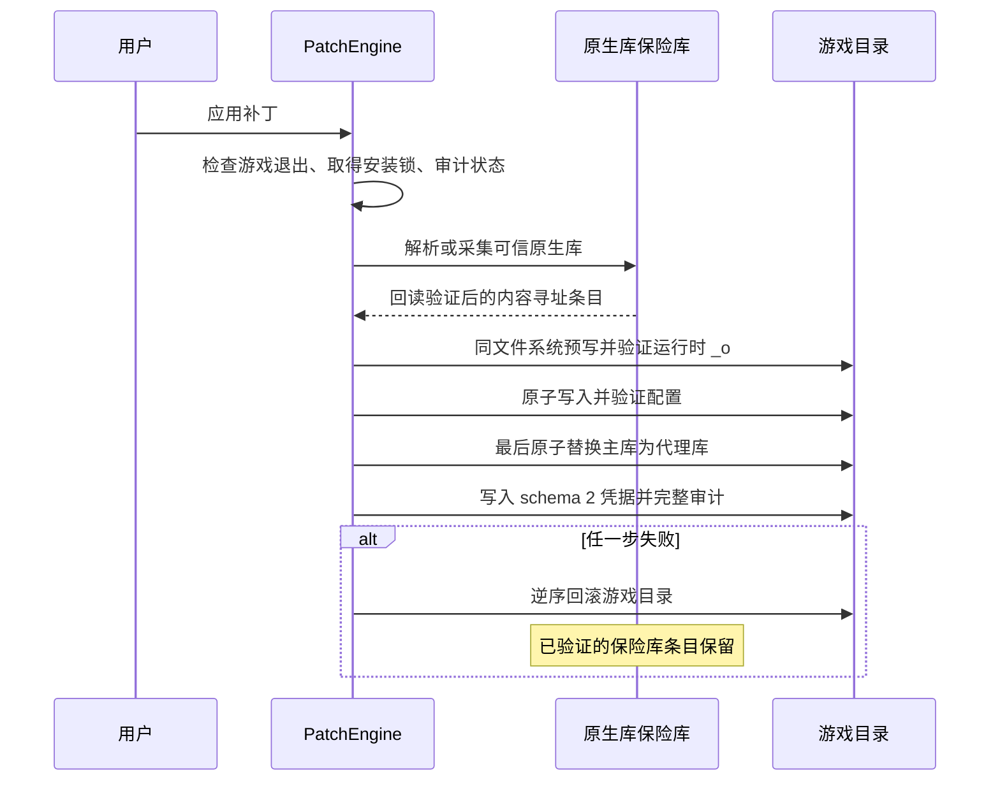
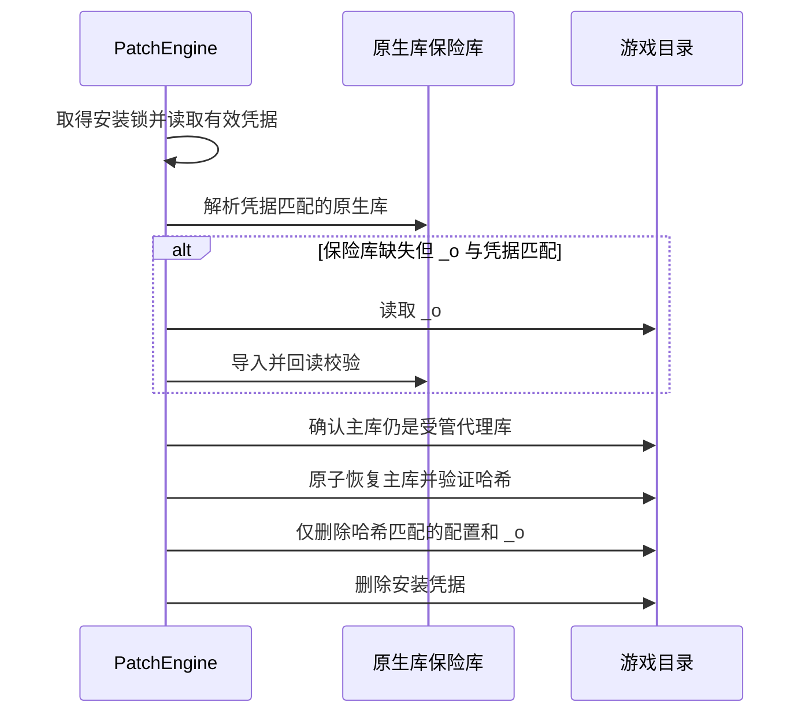
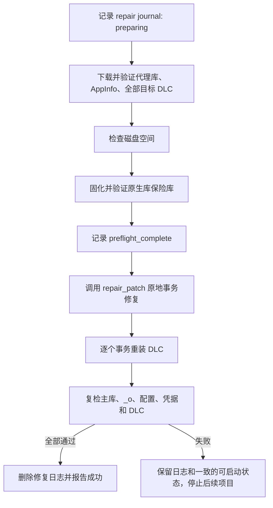

# 原生库生命周期、迁移与修复操作手册

本文是 SignRiver DLC Hub 对游戏原生动态库的唯一生命周期与迁移操作规范。实现、发布、故障处置和人工验收均以本文为准；发布端文档只描述发布资源，跨平台文档只描述平台差异。

## 1. 适用范围与不可突破的底线

支持的平台与架构：

- Windows x64：PE x86_64，运行时文件通常为 `steam_api64_o.dll`。
- SteamOS x64：ELF x86_64，运行时文件通常为 `libsteam_api_o.so`。
- macOS Intel x64：Mach-O x86_64，运行时文件通常为 `libsteam_api_o.dylib`。

本阶段不支持 Apple Silicon 原生库，也不改变代理库必须从同目录加载 `_o` 原生库的机制。

必须同时遵守以下底线：

1. 发布端只提供代理库和 AppInfo，绝不提供游戏原生库。
2. 任何失败路径都不得删除唯一可信的原生库。
3. 无法证明主库、运行时 `_o` 或保险库条目与有效凭据一致时，必须安全阻断。
4. 禁止从其他游戏、其他安装目录、其他用户、网络附件或历史发布资源中拼接原生库。
5. 游戏目录与保险库均没有可信原生库时，提示用户在游戏平台执行“验证游戏文件”，完成后再采集；程序不自动调用平台修复。
6. 常规缓存清理、一键修复、客户端升级和版本回滚不得清除原生库保险库。

## 2. 名词与文件角色

| 名称 | 含义 | 是否发布资产 | 是否可自动删除 |
| --- | --- | --- | --- |
| 主库 | 游戏原本加载的库文件；补丁生效时该路径由代理库占用 | 代理库是，原生内容不是 | 仅可原子替换，不可无来源删除 |
| 运行时原生库 | 代理库同目录加载的 `_o` 文件 | 否 | 成功恢复主库且哈希匹配凭据后可删除 |
| 代理库 | 程序提供并发布的补丁动态库 | 是 | 仅在确认其仍为程序管理版本后替换 |
| AppInfo | 生成补丁配置的元数据 | 是 | 可重新下载 |
| 安装凭据 | 记录受管文件哈希、原生库缓存键和来源的本地记录 | 否 | 成功恢复或明确迁移完成后处理 |
| 原生库保险库 | 用户原生库的持久、内容寻址副本 | 否 | 默认永不自动删除 |
| 修复日志 | 一键修复的阶段和 DLC 进度记录 | 否 | 完整成功后删除，失败或中断时保留 |

卡带字段 `runtime_original_library_name` 只表示代理库运行时需要的同目录文件名，不表示发布端需要准备的资源。解析器暂时接受旧字段 `original_backup_dll_name` 和 `patch_original_backup_name` 作为兼容别名，新卡带不得继续写旧字段。

## 3. 状态判定表

状态判定必须结合主库、运行时 `_o`、配置、安装凭据和保险库，不能只比较文件大小。

| 状态 | 必要判据 | 允许的自动操作 | 禁止操作 |
| --- | --- | --- | --- |
| 原生 | 无有效补丁凭据和程序配置迹象；主库通过平台格式校验；无已知代理库特征或可疑 `_o` 布局 | 首次应用前采集主库到保险库，回读校验后继续 | 未完成保险库固化前替换主库 |
| 已补丁且健康 | schema 2 凭据有效；主库、运行时 `_o`、配置哈希均匹配；保险库含匹配原生库 | 幂等修复、卸载、更新配置 | 用未知文件覆盖 `_o` 或主库 |
| 可修复 | 有有效凭据；保险库条目有效，或 `_o` 哈希与凭据匹配且可导入；某个受管文件缺失或损坏 | 从可信来源重新部署受管文件 | 因 `_o` 缺失直接删除主库 |
| 旧安装可迁移 | schema 1 凭据有效且 `_o` 哈希匹配，或无凭据但完整布局满足严格启发式条件 | 先导入保险库，再写 schema 2 凭据 | 迁移成功前删除或替换旧 `_o` |
| 未知 | 凭据损坏；主库被外部修改；主库与 `_o` 来源无法关联；存在第三方补丁迹象 | 显示阻断原因，建议平台验证文件 | 自动恢复、强制覆盖、猜测来源 |
| 缺失可信原生库 | 保险库无匹配条目，凭据匹配的 `_o` 也不存在，主库又不是明确原版 | 提示平台验证后重新采集 | 删除主库、配置或 DLC 来“尝试修复” |

“通过格式校验”只证明文件是目标平台的 x86_64 动态库，不证明它来自游戏厂商。来源仍需由安装状态和凭据一致性共同判断。

## 4. 持久原生库保险库

### 4.1 目录与身份

根目录固定为：

```text
<context.paths.data>/original-libraries/v1/
```

该目录独立于普通下载缓存。安装身份由以下信息规范化后计算 SHA-256：

- 游戏 ID；
- 平台和 `x86_64` 架构；
- 解析后的游戏根目录；
- 补丁相对目录。

同一安装身份下按原生库 SHA-256 内容寻址，因此游戏升级后可同时保留多个版本。保险库目录名和缓存键只作为定位信息，恢复时仍必须重新校验文件内容。

### 4.2 元数据

每个条目的 `metadata.json` 至少包含：

- schema；
- installation key；
- 运行时原生库文件名；
- 文件大小和 SHA-256；
- `PE`、`ELF` 或 `Mach-O` 格式；
- `x86_64` 架构；
- 来源类型；
- 首次采集时间和最近校验时间。

库文件和元数据均先写同目录临时文件，执行 `flush`/`fsync` 后使用 `os.replace` 原子提交，再回读校验。已存在的同哈希条目只能复用，内容不一致时按保险库损坏阻断。

### 4.3 可信来源优先级

只允许按以下顺序解析原生库：

1. 与有效安装凭据中的原生库哈希、安装身份和缓存键匹配的保险库条目。
2. 与有效凭据中原生库哈希匹配的游戏目录 `_o`；先导入保险库并验证，再使用保险库副本。
3. 首次应用时，处于明确原版状态且不存在程序或第三方补丁迹象的主库；先采集保险库，再修改游戏目录。

不能从“文件名相同”“大小约 283 KB”或“能被加载”推断可信来源。

### 4.4 安全校验

采集和部署前必须检查：

- 解析后的路径不越出游戏根目录或保险库根目录；
- 文件及现存祖先目录不是符号链接或 Windows reparse point；
- 文件存在、非空且不超过 128 MiB；
- Windows 为 PE x86_64，SteamOS 为 ELF x86_64，macOS 为 Mach-O x86_64；
- SHA-256 与凭据或内容寻址目录一致；
- Unix 部署运行时副本时保留可用权限位。

### 4.5 回收规则

保险库默认不自动回收。未来若提供“清理原生库备份”，必须同时满足：

1. 游戏主库已恢复为原生库并通过哈希验证；
2. 不存在活动补丁凭据；
3. 条目不再被其他有效安装记录引用；
4. 用户明确确认将失去本地恢复能力。

普通“清理缓存”、一键修复、卸载 DLC 或客户端回滚均不得触发此流程。

## 5. 安装、卸载与修复事务

所有会修改游戏库的入口都必须先取得按安装身份划分的跨进程非阻塞锁。锁冲突时提示用户等待当前操作完成，不得并发执行两个补丁事务。

### 5.1 应用补丁



操作顺序固定：

1. 确认游戏和相关启动器已退出；Windows 文件被占用时立即阻断。
2. 审计主库、`_o`、配置、凭据和保险库。
3. 先将可信原生库完整固化到保险库并回读校验。
4. 在游戏目录同一文件系统预写临时文件。
5. 先部署 `_o`，再部署配置，最后用代理库替换主库。
6. 最后写 schema 2 凭据并执行完整哈希审计。
7. 失败时回滚游戏目录；已经验证的保险库副本不回滚、不删除。

### 5.2 卸载或恢复原版



若主库被外部修改，或原生库无法从保险库/凭据匹配的 `_o` 解析，立即阻断。任何情况下都不得因为 `_o` 缺失而删除当前主库。

### 5.3 一键修复



一键修复不得调用旧 `reset()`，不得预先批量卸载 DLC。所有资源和原生库未准备完成前，不得执行破坏性变更。DLC 必须逐项事务重装，只有新文件树验证成功后才清理该项旧受管文件；单项失败时停止后续项目。

### 5.4 崩溃恢复

修复日志位于：

```text
<context.paths.data>/repair-journals/v1/<安装身份>.json
```

日志记录请求的 DLC、已完成 DLC、阶段、状态、消息和更新时间，使用原子覆盖。当前实现的续作语义是：

- 程序中断或重启后日志保留；
- 用户再次点击“一键修复”时，界面提示发现未完成记录；
- 程序从安全预检阶段幂等重放资源准备、补丁修复和剩余安装；
- 不会在程序启动后自动执行，也不会直接跳入上次的破坏性中间点；
- 完整成功后删除日志，失败时保留用于下一次重试和诊断。

普通补丁事务本身使用临时文件、原子替换和事务备份。启动后若审计发现中间状态，仍按状态表处理，不以“存在临时文件”为理由猜测恢复。

## 6. 安装凭据与旧安装迁移

### 6.1 schema 2

schema 2 至少记录：

- 游戏 ID、平台、安装身份和补丁目录；
- 代理库、运行时原生库、配置文件 SHA-256；
- 原生库 SHA-256、保险库缓存键和采集来源；
- 创建或迁移时间。

凭据用于证明“程序曾管理哪些具体字节”，不能证明文件的厂商来源。schema 1 只读兼容，不再作为新写入格式。

### 6.2 schema 1 迁移矩阵

| schema 1 状态 | 处理 | 结果 |
| --- | --- | --- |
| 凭据有效，`_o` 哈希匹配 | 导入保险库，回读验证，写 schema 2 | 自动迁移；迁移成功前保留旧 `_o` |
| 凭据有效，保险库已有匹配条目 | 校验条目并写 schema 2 | 自动迁移 |
| 凭据有效，但 `_o` 与记录不匹配 | 阻断 | 不替换、不删除任何库 |
| 凭据缺字段、JSON 损坏或路径不一致 | 视为损坏凭据并阻断 | 提示平台验证文件 |
| 主库已被外部修改 | 阻断自动卸载和修复 | 保留现场供人工判断 |

### 6.3 无凭据旧安装矩阵

| 现场 | 处理 |
| --- | --- |
| 主库匹配已知程序代理库、配置为程序格式、`_o` 内容不同且通过平台格式校验 | 可按严格迁移路径导入；任何一步不满足即阻断 |
| 只有明确原版主库，无 `_o`、无程序配置迹象 | 可作为首次安装采集 |
| 主库与 `_o` 均未知 | 阻断 |
| 主库与 `_o` 内容相同 | 阻断，不能判断哪个是可信原版 |
| 主库或 `_o` 之一缺失且另一文件带补丁迹象 | 阻断 |
| 两个库均缺失 | 阻断并提示平台验证 |
| 部分配置残留或第三方补丁迹象 | 阻断，不自动清理现场 |

## 7. 三平台操作注意事项

### 7.1 Windows x64

- 校验 PE 头和 `IMAGE_FILE_MACHINE_AMD64`。
- 修改前要求游戏、Steam 和相关启动器退出；文件占用或共享冲突时立即阻断，不循环强删。
- 临时文件必须位于目标文件同卷、同目录或可保证同卷原子替换的位置。
- 路径检查覆盖文件及其现存祖先，拒绝符号链接和 reparse point。
- 不依赖约 283 KB 的经验大小判定原生库。

### 7.2 SteamOS x64

- 校验 ELF 64 位、小端和 x86_64 machine。
- 路径和文件名严格区分大小写。
- 拒绝符号链接跳转；解析后的路径必须留在声明目录内。
- 保险库部署 `_o` 时保留可用模式位，不通过扩大目录权限来解决失败。
- 真实验收需覆盖只读目录、权限拒绝、非拥有者文件和中断恢复。

### 7.3 macOS Intel x64

- 校验 Mach-O x86_64；本阶段不接受 arm64-only 文件。
- 不修改、不重新签名用户原生库，采集和部署前后必须保持哈希一致。
- 仅对程序提供的代理库及既有应用层要求执行 ad-hoc 签名；签名后再次确认原生库哈希未变化。
- `.app` bundle 与可写数据目录职责分离；保险库存放于用户 Application Support 数据根，不写入已签名 bundle。

## 8. 发布切换与回滚

### 8.1 发布前盘点

1. 确认所有卡带已使用 `runtime_original_library_name`。
2. 确认客户端同时可读取旧三资产 Release 和新两资产 Release。
3. 确认旧 Release 中额外原生库会被忽略，而不是作为候选来源。
4. 完成 schema 1、无凭据旧安装、一键修复中断和三平台目录测试。
5. 为每个平台准备至少一个合法安装环境进行真实应用、修复、启停和恢复验收。

### 8.2 发布顺序

1. 先发布兼容新旧资源合同的客户端，并把它设为新两资产 Release 的最低客户端版本。
2. 完成旧安装迁移和中断修复验收。
3. 再切换发布器：输入、输出、UI 和验收只要求代理库与 AppInfo。
4. 每个平台先选择一个合法安装做小范围验收，再发布其余游戏资源。
5. 稳定后才清理本地 `publisher-workspace` 中不再使用的原生库；不得删除历史线上资产。

### 8.3 回滚

若新流程异常：

- 立即停止发布新的两资产 Release；
- 客户端继续读取历史 Release；
- 不删除用户保险库、运行时 `_o` 或游戏主库；
- 不为回滚重新把原生库加入新发布资源；
- 根据凭据和保险库执行受控恢复，无法确认时要求平台验证。

历史线上 Release 中已有的原生库资产为兼容旧客户端而保留，新客户端必须忽略它们。回滚发布器或客户端代码不等于回收用户原生库。

## 9. 验收清单

### 9.1 自动化

- 保险库：首次/重复采集、多版本、多安装目录、损坏文件/元数据、磁盘满、权限拒绝、原子写失败。
- 补丁事务：在每个写入、替换和凭据提交点注入失败；主库和 `_o` 不得同时丢失。
- 卸载：保险库存在、仅凭据匹配 `_o` 存在、两者缺失、主库被修改、凭据损坏。
- 一键修复：资源失败、原生库预检失败、单 DLC 失败、程序中断、再次点击后幂等续作。
- 兼容：旧三资产 Release 可读且原生资产被忽略；新两资产 Release 可用；schema 1 可迁移；模糊旧安装被阻断。
- 发布器：缺少原生库不报错，输出和验收不含原生库，UI 无“原版备份 DLL”字段。
- 三平台临时目录：路径越界、链接/reparse point、格式、权限、模式位和文件锁。

### 9.2 真实安装验收

每个平台至少执行：

1. 原版状态采集并检查保险库元数据和哈希；
2. 应用补丁并启动/退出游戏；
3. 原地修复并再次启动；
4. 中断一次一键修复，再次点击并完成；
5. 恢复原版，确认主库哈希、`_o`/配置清理和凭据移除；
6. 验证保险库仍保留且普通缓存清理不影响它。

最终底线：任何预检失败都不得先删除 DLC 或库文件；任何失败路径都不得删除唯一可信原生库；未完整复检不得报告成功。
